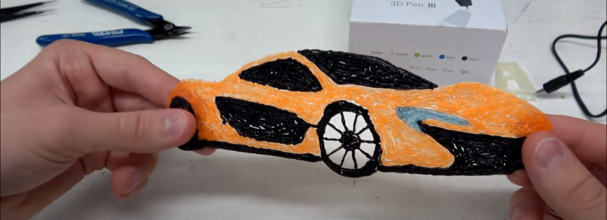

Ateliers numériques dans les centres aérés de Sambre Avesnois

> *Ce programme est destiné à évoluer d'ici début juillet. Il représente une ébauche pour montrer l'avancement du projet avec les idées me venant au fur et à mesure. **N'hésitez pas à me soumettre vos retours par mail** : [charles.vin@outlook.fr](mailto:charles.vin@outlook.fr)*

# Déroulement général
La première semaine se passe à Saint-du-Nord, la deuxième à Cartignies et la troisième à Solre-le-Château. 

# Activité proposé

## Drone 
### Matériel
- 2 petits drones d'intérieur
- 2 plus grand d'extérieur

### Description 
Inhitiation au pilotage des drones 

## Atelier vidéo
>  Ce petit paragraphe fait je pense partie de l'ancien projet. Cependant je le laisse car un atelier 'Montage vidéo' est dans le "cahier des charges". 
 
Cette activité vidéo aura pour finalité de faire participer chaque centre à la réalisation d'un mini-film autour du thème du pays des merveilles. Elle suivra la trame scénaristique inspirée de `Game of Thrones` mais avec plus de féerique :
> - La paix en Sambre Avesnois
> - Rompu par l'enlèvement d'une princesse et l’assassinat du roi d'un des centres
> - Chaque centre aéré veut s'assoir sur le trône et défendre sa ville
> - Une bataille sur fond vert
> - Magicien, dragons
> - Unification des centres aéré face à la menace *du réchauffement climatique ?* ou *d'un grand méchant* 

L'utilisation de `Fond vert` et de la technique du `Stop motion` sera abordé.

## Stop Motion 
### Matériel :
- Smartphone
- Pâte à modeler
- Figurines
- Tout ce qui peut être utile pour de l'animation

### Description
Réalisation d'un film court en stop-motion.

## Dessin animé 
### Matériel
- De quoi dessiner
- 3 tablettes graphique
- 3 PC

### Description
A partir des tablettes graphiques, animer les dessins des enfants : 
- [TupiTube](https://www.01net.com/telecharger/windows/Multimedia/animation_2d_et_3d/fiches/145682.html) 
- [Vidéo faite à Maubeuge](https://www.youtube.com/watch?v=NiUu138qtFs)

### Déroulement
1. Les enfants imagine leurs projets, ce qu'ils vont desiner.
2. Ils choisisent un arrière plan. Dessine leurs personnages sur papier
3. Puis on passe aux tablettes graphiques et au logiciel TupiTube
4. Création d'un projet dans le logiciel en 12fps

## Dessins en Réalité augmenté
### Matériel
- Smartphone
- Internet

### Description
 [Vidéo de démonstration](https://www.youtube.com/watch?v=B09Mj6tLrx8) 
**=> Probablement trop ennuyeux pour les adolescents ??**

### Déroulement
1. Chosir un dessin parmis ceux disponible
2. Le colorier
3. L'animer dans l'appli mobile

### Crayons d'impression 3D 
#### Matériel
- Crayons d'impression 3D 
- Bobine de couleur
- *Une imprimante*

#### Description
L'utilisation de crayons d'impression 3D pour reproduire des formes, des dessins. Ces dessins pourront être choisis par les enfants (si dispo d'une imprimante) ou choisis parmis ceux que je ramène. 
Dessiner avec le crayon sera alors très facile car il suffira de décalquer. Ils pourrons ramener leurs oeuvres à leur domicile. 

Par exemple une voiture, des lunettes, un coeur avec le nom de leurs parents, ... 

#### Déroulement
1. Choix d'un dessins à reproduire (sur internet puis impression, ou parmis ceux proposé)
2. Faire le dessins en décalquant

## Atelier code
Scratch, assez classique, montre les bases de l'algorithmique d'une manière ludique aux enfants. 
Autre site de code : [https://declick.net/](https://declick.net/)
Probablement des centaines d'autres possibilités
> Mon cousin, qui est en 5ème, joue *naturellement* beaucoup à `Fornite` et m'avais parlé qu'il aimerait bien un peu savoir ce qui se passe  *behind the scene* avec du code. 

### Carte micro-bit
- Un projet ludique pour les 6-7 ans
- Un autre plus poussé pour les plus grand

`Explication de code et des branchements`
Peut-être un kit de voiture télécommandée où ils peuvent faire le branchement puis la contrôler, on peut y placer une caméra également et la brancher sur un petit casque VR.
> Ici, pour décider des projets, il faut que je voie en fonction du matériel disponible à la 3CA.

